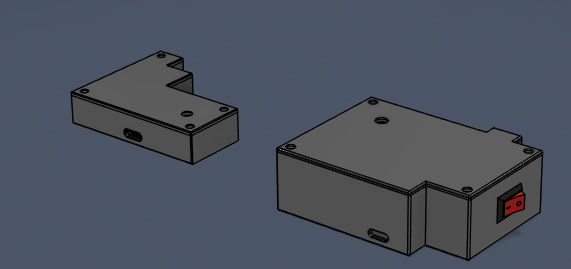
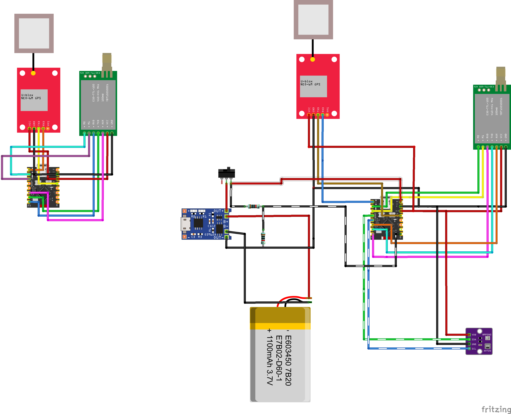

# Tracker

## Project description:
This is a tracker for various objects, such as drones or kites. Within a radius of approximately eight kilometres, the GPS signal can be tracked, depending on line of sight and obstacles. You can then see the location and distance. The range is only around 8 kilometres under ideal conditions.

## How it works:
You plug a USB stick containing the entire firmware into the PC. Then you plug your own ESP32-C3 Super Mini into the PC and attach the tracker to the object you wish to track. The tracker automatically sends signals to the ESP connected to the PC via a LoRa module, and these are then displayed. Ideally, it is also displayed on a map: your own location and the location of the tracker. Various settings can also be adjusted via the PC, such as the power-saving mode. On the PC, you can see the altitude, temperature, air pressure, battery voltage and the current time via a BMP280 and an AHT20 module built into the board.

## Why I built this project:
My kite flew away recently because the string snapped. Now it’s lying somewhere in the woods, high up in the trees. I haven’t been able to find it. If the kite had had a tracker, I would have been spared the whole search, because then I could have seen where it was in the software. I would simply have retrieved it. And a drone has flown away from me once before, too. It would have been handy if it had had a tracker as well, so that I could have located it.

## Visuals

